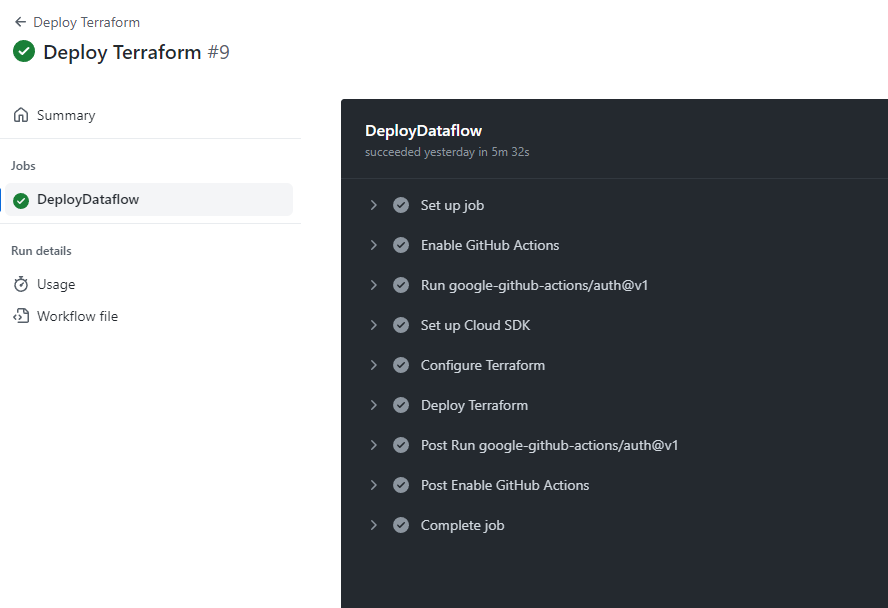
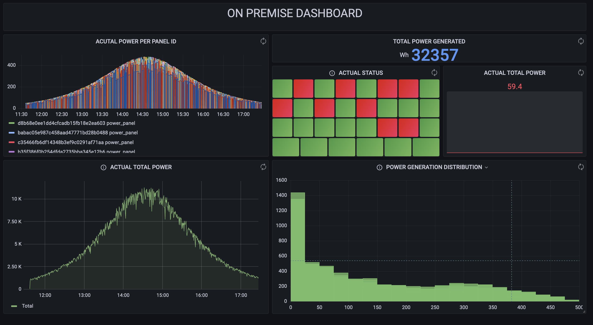

# DATA PROJECT 2


<p align="center">

</p>

<br>

## DESCRIPCIÓN

La empresa de placas solares **SolarMinds Technologies [^1]** ha decidido montar una infraestructura de gestión de los datos que cada placa individual genera para poder estimar la producción total de energía, así como monitorizar el estado de cada placa solar para facilitar las tareas de mantenimiento. En principio, dicha empresa tiene en su sede central montados y funcionados una serie de servidores que le gustaría utilizar para este proyecto. Nuestro objetivo como consultores es, primero facilitarles una herramienta E2E on premise que puedan usar para sacar la mayor cantidad de información valiosa posible pero, por otro lado, queremos enseñarles también las ventajas que supondría tener este software en el Cloud. 


<br>

## Equipo

- [Elyca Jardín](https://www.linkedin.com/in/elycajardin/): Máster en Ingeniería Marítima. Encargada de la parte de Business Inteligence y Data Analytics utlizando Grafana Cloud y Looker Data Studio

- [Pablo Martínez](https://github.com/Pablomartiver): Economista. Encargado de la parte de Data Engineering relativa a la cola de mensajes en Pub/Sub y Kafka (On premise)

- [Jorge Martínez](https://github.com/joorgemartinez): Licenciado en ADE. Parte del equipo de Data Engineering del proyecto. Desarrollo de código Python para Dataflow y Cloud Functions así como de Spark (On premise)

- [Miguel Moratilla](https://github.com/mimove): Doctor en Ing. Aeroespacial. Encargado Senior del proyecto. Responsable de la generación de los datos y la parte DevOps del proyecto. Diseño de la arquitectura, y dirección del proyecto distribuyendo tareas entre los componentes del equipo.

<br>

En este repositorio, se encuentra la solución en Google Cloud que hemos diseñado. Consta de las siguientes partes:

1. Generador de datos con envío a Pub/Sub 

2. Dataflow para transformación de los mensajes

3. BigQuery como almacenamiento

4. Cloud functions para avisos

5. Grafana Cloud para visualización

<br>

## Generador de datos (PUB/SUB)

Para simular el comportamiento de un placa solar, se ha optado por utilizar una ecuación basada en la secante hiperbólica, cuya distribución es muy similar a una distribución normal. La ecuación utilizada es:

$$\mathrm{P}=\frac{\mathrm{P_{max}}}{\cosh((t-t_{ini})*C-t_{ini})^{C}}$$


Donde $\mathrm{P_{max}}$ es la potencia máxima del panel, $t_{ini}$ la hora a la que empieza a generar energía, y $C$ es una constante que se utiliza para modificar el ancho de la curva.

La siguiente figura muestra como se vería la curva para una placa solar que produjera durante una hora, con un máximo de potencia de 400W:

<p align="center">

</p>


Con esta ecuación, el generador de datos lo que simula es una serie de contenedores Docker, siendo cada contenedor una placa solar individual, que tiene una probabilidad dada cada n segundos de estar produciendo energía o no.


Para ejecutar el codigo del generador correctamente hay que realizar los siguientes pasos:

1. Construir la imagen Docker de solar_gen. Para ello hay un script en la carpeta [solar_panel](./data-generator/solar_panel/) que se llama init.sh

2. Una vez construida la imagen, se puede ejecutar el siguiente código Python para enviar la info a Pub/Sub

    ```sh
    python3 main.py --topcontainers <num_paneles> \
        --elapsedtime <t_delay> \
        --image solar_gen \
        --project_id <GCP project ID> \
        --topic_name <GCP pub/sub topic>
    ```


<br>

## DATAFLOW

Dentro de la carpeta de dataflow, se encuentra el código Python escrito utilizando la librería Apache BEAM para consumir los datos generador por los paneles solares mediante una subscripción al tópico de Pub/Sub. En Dataflow se realizan los siguientes pasos:

1. Primero se leen los mensajes escritos en formato JSON que se encuentran en el tópico, creando una PColletion con el contenido de los mensajes

2. Los datos recibidos se guardan en una tabla de BigQuery  que tiene el siguiente schema:

```sh
{
    "fields": [
    {
      "mode": "NULLABLE",
      "name": "Panel_id",
      "type": "STRING"
    },
    {
      "mode": "NULLABLE",
      "name": "power_panel",
      "type": "FLOAT64"
    },
    {
      "mode": "NULLABLE",
      "name": "current_status",
      "type": "INT64"
    },
    {
      "mode": "NULLABLE",
      "name": "current_time",
      "type": "TIMESTAMP"
    }
    ]
}
```


3. Mediante el uso de una ventana, se obtiene la potencia total instantánea generada por los paneles, y se escribe en un tópico de Pub/Sub para utilizar luego en las Cloud Functions como disparador de una aviso.


4. Se calcula otra ventana para sacar la media en franjas de 30 segundos de la potencia media generada por los paneles, y se escribe el resultado de la PCollection en otra tabla de BigQuery


Para ejecutar este código se puede hacer de 2 formas:

1. Ejecutando el siguiente comando desde la terminal:

    ```sh
    python3 dataflow.py \
        --project_id <project_id> \
        --input_subscription <topic_name>-sub \
        --output_bigquery <dataset_bigquery>.Panel_Data \
        --runner DataflowRunner \
        --job_name dataflow-solar \
        --region <GCP region> \
        --temp_location gs://<bucket(project_id)>/tmp \
        --staging_location gs://<bucket(project_id)/stg
    ```

2. A partir de GitHub actions usando el archivo de Terraform main.tf que se encuentra también en esta carpeta.

    Para este segundo caso, primero se tiene que construir la Flex-Template, que será almacenada en el Bucket storage de Google Cloud. Esto se consigue ejecutando los siguientes comandos:

    ```sh
    gcloud builds submit --tag 'gcr.io/<Bucket ID>/dataflow/data-project2:latest' .

    gcloud dataflow flex-template \
             build "gs://<Bucket ID>/data-project2-flowtemplate.json" \
            --image 'gcr.io/<Bucket ID>/dataflow/data-project2:latest' \
            --sdk-language "PYTHON"
    ```

    Una vez que se ha construido la Flex Template dentro del proyecto de Google Cloud, se tiene que subir el repositorio a GitHub. Dentro de la carpeta [.github/workflows](./github/workflows/) existen dos archivos yaml, que sirven para ejecutar las GitHub actions de despliegue y parada de Dataflow. La siguiente imagen muestra una captura de pantalla de como se realiza el despliegue:

    <p align="center">
    
    </p>

<br>

## GRAFANA CLOUD

En la parte de visualización, se ha creado un dashboard que se muestra en la siguiente imagen para un ejemplo con 30 placas solares:


<p align="center">

</p>


<br>

[^1]: Logo y nombre creados con la inteligencia artificial [Dall·E 2](https://openai.com/dall-e-2/) y ChatGPT respectivamente.